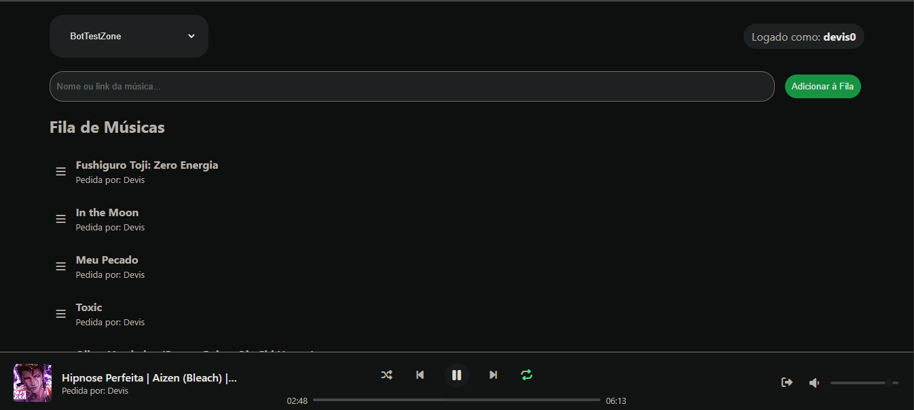
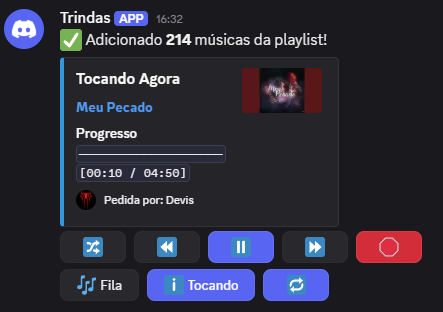

# 🎵 Trindas Bot - Um Bot de Música Self-Hosted para Discord com Dashboard Web


**Trindas Bot** é uma solução completa e de código aberto para quem deseja ter seu próprio bot de música no Discord, com total controle através de uma interface web moderna e reativa construída com FastAPI e WebSockets.




---

## Funcionalidades

- **Player Completo:** Toca músicas e playlists do YouTube.
- **Dashboard Web Interativo:** Controle o player, veja a fila, adicione músicas e reordene arrastando e soltando.
- **Sincronização em Tempo Real:** Ações no Discord atualizam a web instantaneamente (e vice-versa).
- **Controles Avançados:** Fila, loop (fila/música), shuffle, pular, voltar, volume, etc.
- **UI Dinâmica no Discord:** Mensagem "Tocando Agora" com botões que se atualizam em tempo real.
- **Segurança:** Login com Discord (OAuth2) para o dashboard web.

---

## Guia de Instalação (Self-Hosting)

Este guia cobre a instalação em ambientes **Windows** (para testes) e **Linux** (para produção 24/7).

### 1. Pré-requisitos

Garanta que você tem os seguintes programas instalados no seu sistema:

<details>
<summary><strong>Instruções para Windows</strong></summary>

- **Python 3.11+:** Baixe em [python.org](https://python.org). Durante a instalação, **marque a caixa "Add Python to PATH"**.
- **Git:** Baixe em [git-scm.com](https://git-scm.com/download/win).
- **FFmpeg:**
    1. Baixe a última versão "release-full" em [gyan.dev](https://www.gyan.dev/ffmpeg/builds/).
    2. Descompacte o arquivo e mova a pasta para um local permanente (ex: `C:\ffmpeg`).
    3. Adicione a pasta `bin` do FFmpeg ao PATH do sistema.
        - Pressione `Win`, digite "Variáveis de ambiente" e abra "Editar as variáveis de ambiente do sistema".
        - Clique em "Variáveis de Ambiente...", selecione a variável `Path` em "Variáveis do sistema" e clique em "Editar...".
        - Clique em "Novo" e adicione o caminho, por exemplo: `C:\ffmpeg\bin`.
        - Dê OK em todas as janelas e **reinicie seu terminal**.

</details>

<details>
<summary><strong>Instruções para Linux (Debian/Ubuntu)</strong></summary>

- Execute o seguinte comando para instalar tudo de uma vez:
  ```bash
  sudo apt update && sudo apt upgrade -y
  sudo apt install python3 python3-pip python3-venv ffmpeg git -y
  ```

</details>

### 2. Configuração do Bot no Discord

Você precisa criar uma "Aplicação" no Discord para o seu bot.

1.  Vá para o **[Portal de Desenvolvedores do Discord](https://discord.com/developers/applications)**.
2.  Crie uma **"New Application"**.
3.  Na aba **"Bot"**, clique em "Add Bot" e copie o **Token**.
4.  Na aba **"OAuth2"**, copie o **Client ID** e o **Client Secret**.
5.  Ainda em "OAuth2", na seção **"Redirects"**, adicione a URL: `http://IP_DO_SERVIDOR:8000/callback` (substitua pelo IP da máquina onde o bot vai rodar). Para testes locais no seu PC, use `http://127.0.0.1:8000/callback`.
6.  Salve as alterações.

### 3. Instalação do Projeto

Abra seu terminal (CMD ou PowerShell no Windows, Terminal no Linux) e siga os passos:

1.  **Clone o repositório:**
    ```bash
    git clone https://github.com/DevisBorg/trindas_bot.git trindas-bot
    cd trindas-bot
    ```

2.  **Crie o Ambiente Virtual:**
    ```bash
    python3 -m venv venv
    ```

3.  **Ative o Ambiente Virtual:**
    - **No Windows (CMD/PowerShell):**
      ```cmd
      venv\Scripts\activate
      ```
    - **No Linux/macOS:**
      ```bash
      source venv/bin/activate
      ```
    *Seu terminal agora deve mostrar um `(venv)` no início.*

4.  **Instale as dependências do Python:**
    ```bash
    pip install -r requirements.txt
    ```

### 4. Configuração do Ambiente (`.env`)

Este projeto usa um arquivo `.env` para gerenciar as chaves secretas, mantendo-as seguras e fora do controle de versão.

1.  **Crie seu arquivo `.env`:**
    Faça uma cópia do arquivo de exemplo `.env.example` e renomeie a cópia para `.env`.
    - No Linux, você pode usar o comando:
      ```bash
      cp .env.example .env
      ```
    - No Windows, simplesmente copie e renomeie o arquivo.

2.  **Preencha as variáveis:**
    Abra o seu novo arquivo `.env` e preencha cada variável com as chaves que você obteve do Portal de Desenvolvedores do Discord e com o IP da máquina que irá rodar o bot. O resultado final deve ser similar a este:

    ```ini
    # .env
    DISCORD_TOKEN=SEU_TOKEN_DO_DISCORD_AQUI
    OAUTH2_CLIENT_ID=SEU_CLIENT_ID_AQUI
    OAUTH2_CLIENT_SECRET=SEU_CLIENT_SECRET_AQUI
    OAUTHLIB_INSECURE_TRANSPORT=1
    SERVER_IP=127.0.0.1 # Use 127.0.0.1 para testes locais ou o IP da sua rede
    ```
### 5. Executando a Aplicação

<details>
<summary><strong>Para Testes (Windows ou Linux)</strong></summary>

- Com o ambiente virtual ativado, rode o comando:
  ```bash
  uvicorn main:app --reload
  ```
- O bot e o dashboard estarão online. Para parar, pressione `Ctrl+C` nesta janela. **A janela precisa ficar aberta.**

</details>

<details>
<summary><strong>Para Host 24/7 em Linux (Para Windows o programa "nssm" pode ser usado, mas não irei abordar aqui *Skill Issue*)</strong></summary>

- Crie o arquivo de serviço:
  ```bash
  sudo nano /etc/systemd/system/trindasbot.service
  ```
- Cole o conteúdo abaixo, **alterando `User` e `Group` para seu nome de usuário no Linux**, e o `WorkingDirectory` para o caminho onde você clonou o projeto.

  ```ini
  [Unit]
  Description=Trindas Bot com Dashboard Web
  After=network.target
  Wants=network-online.target
  [Service]
  User=seu_usuario_linux
  Group=seu_usuario_linux

  WorkingDirectory=/caminho/para/o/trindas-bot
  ExecStart=/caminho/para/o/trindas-bot/venv/bin/python -m uvicorn main:app --host 0.0.0.0 --port 8000

  Restart=always
  RestartSec=10

  [Install]
  WantedBy=multi-user.target
  ```
- Ative e inicie o serviço:
  ```bash
  sudo systemctl daemon-reload
  sudo systemctl enable trindasbot.service
  sudo systemctl start trindasbot.service
  ```
- Para ver os logs: `sudo journalctl -u trindasbot.service -f`
- Para ver os status: `sudo systemctl status trindasbot.service`

</details>

---

### Acessando o Dashboard Web

- Se estiver rodando em um servidor Linux, libere a porta no firewall: `sudo ufw allow 8000/tcp`.
- Abra seu navegador e acesse: `http://IP_DA_MAQUINA_DO_BOT:8000`.

---

### 💸 Apoie o Projeto

Gostou do bot? Considere apoiar o desenvolvimento!

**Livepix:**
[https://livepix.gg/devis](https://livepix.gg/devis)

---

### ⚖️ Aviso Legal

Este projeto é fornecido como está e para fins educacionais. Os usuários são responsáveis por garantir que seu uso esteja em conformidade com os Termos de Serviço das plataformas de onde o áudio é extraído.

---

### 📄 Licença

Este projeto está licenciado sob a **Licença MIT**.
